# 🏭 Aluminium Production Optimization using Reinforcement Learning  
*A Django + Machine Learning Powered Smart Industry Simulation*

 


---

## 🧭 Overview

This project models a **Reinforcement Learning–driven aluminium manufacturing process** where four intelligent roles—**Deligator**, **Agent**, **Environment**, and **Scrap Management**—collaborate through a Django-based web system.  
It uses **machine learning (Quantile Regression)** to predict aluminium yield, manage production residue, and optimize industrial efficiency.

Each role operates as a separate Django app communicating via shared database states.  
This makes it modular, scalable, and easily extendable for future AI-based reinforcement feedback.

---

## 🧩 System Architecture

```mermaid
flowchart LR
    A[Deligator 🧾] --> B[RL Agent 🧠]
    B --> C[RL Environment ⚙️]
    C --> D[Scrap Management ♻️]
    D --> A
```



## 🌀 Workflow:
**1. Deligator** sends raw material data.

**2. Agent predicts** aluminium output via ML.

**3. Environment** simulates feedback.

**4. Scrap Management** processes residue and closes the production loop.

---

## ⚙️ Tech Stack

| Category | Technologies |
|-----------|--------------|
| **Backend** | Django 5.1.1, Python 3.11 |
| **Frontend** | HTML5, CSS3, Bootstrap (to be migrated to CDN v5) |
| **Database** | MySQL (Primary), SQLite (Dev) |
| **Machine Learning** | Scikit-learn (QuantileRegressor), Pandas, NumPy |
| **Visualization** | Matplotlib, Seaborn |
| **File Handling** | OpenPyXL (Excel), Joblib |
| **Environment** | Virtualenv, `.env` (planned) |

---

## 🧠 Machine Learning Model

### 🎯 Model: `QuantileRegressor`
A regression model trained to predict aluminium yield based on six features:

| Feature | Description |
|----------|--------------|
| Bauxite | Primary ore |
| Aluminium Oxide | Refined bauxite |
| Carbon | Electrolytic agent |
| Aluminium Fluoride | Catalyst for reduction |
| Cryolite | Flux material |
| Electrical Energy | Power consumed during smelting |

#### 📈 Prediction Pipeline:
```python
def algorithm(datas, _):
    df = pd.read_csv("aluminium dataset.csv")
    X, y = df.iloc[:, :-1], df.iloc[:, -1]
    X = X.apply(pd.to_numeric, errors="coerce").fillna(0)
    y = pd.to_numeric(y, errors="coerce").fillna(0)
    model = QuantileRegressor()
    model.fit(X, y)
    pred = model.predict(np.array(datas, dtype=float).reshape(1, -1))[0]
    return float(pred)
```

This model is used by the **Agent app** to forecast yield, which is then stored and visualized in the **Deligator dashboard**.

---

## 👤 User Roles & Routes

| Role | Login URL | Purpose |
|------|------------|----------|
| 🧠 **Agent** | `/agent_login/` | Predict aluminium yield |
| ⚙️ **Environment** | `/environment_login/` | Simulate RL environment |
| 🧾 **Deligator** | `/deligator_login/` | Manage raw materials & analytics |
| ♻️ **Scrap** | `/scrap_login/` | Handle residue management |

---

## ✨ Key Features

✅ Role-based login and dashboards  
✅ Aluminium output prediction using Quantile Regression  
✅ Real-time residue calculation and feedback  
✅ CSV/Excel data integration  
✅ MySQL-backed persistent storage  
✅ Matplotlib/Seaborn data visualization  
✅ Modular and scalable design  


## 🚀 Setup & Installation

```bash
git clone https://github.com/<your-username>/aluminium-rl.git
cd aluminium-rl
python -m venv venv
venv\Scripts\activate
pip install -r requirements.txt
python manage.py migrate
python manage.py runserver
```

Visit 👉 **http://127.0.0.1:8000/**

